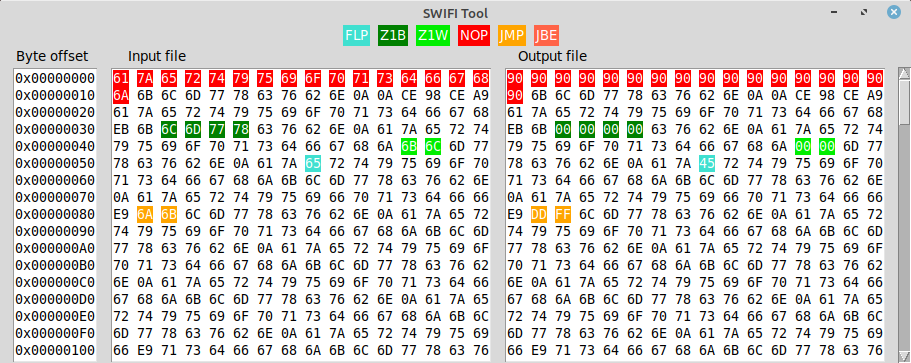

# SoftWare Implemented Fault Injection Tool
Inject faults in executable files based on several fault models.  
**Usage :**
```
$ python3 faults_inject.py -h

usage: faults_inject.py [-h] -i INFILE -o OUTFILE [-w WORDSIZE]
                        [-a ARCHITECTURE] [-g] [-f FILE_MODELS]
                        [FAULT_MODEL [FAULT_MODEL ...]]

Software implemented fault injection tool

positional arguments:
  FAULT_MODEL           one fault model followed by its parameters
                        The possible models are :
                            FLP addr significance        flip one specific bit
                            Z1B addr                     set one byte to 0x0
                            Z1W addr                     set one word to 0x0
                            NOP addr                     nop one address (1 or 2 bytes depending on arch)
                            JMP addr target              change the jump to point on the target (relative near JMP on x86; B and BL on ARM)
                            JBE addr target              change the conditional jump to point on the target (relative near Jcc on x86; B and BL with a condition on ARM)
                        addr can be a number or a range (number-number)

optional arguments:
  -h, --help            show this help message and exit
  -i INFILE, --infile INFILE
                        path to the source file
  -o OUTFILE, --outfile OUTFILE
                        path to the destination file
  -w WORDSIZE, --wordsize WORDSIZE
                        number of bytes in a word
  -a ARCHITECTURE, --arch ARCHITECTURE
                        architecture of the executable (x86 or arm)
  -g, --graphical       open a window comparing the input and the output
  -f FILE_MODELS, --fromfile FILE_MODELS
                        read the faults models from a file instead of command line
```

**Screenshots :**  
  
The `-g` option will display a comparison of the hexadecimal content between the initial file and the edited file.

For more details, see the [example page](./examples/README.md).
